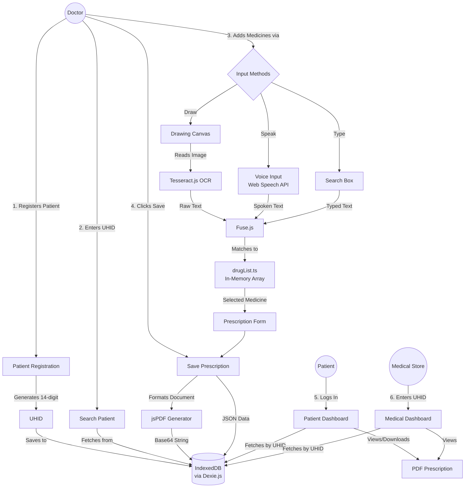
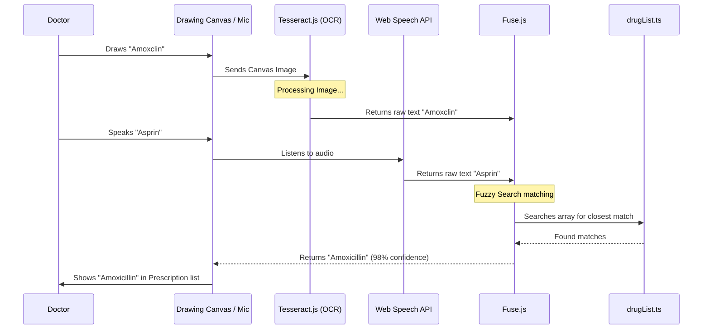
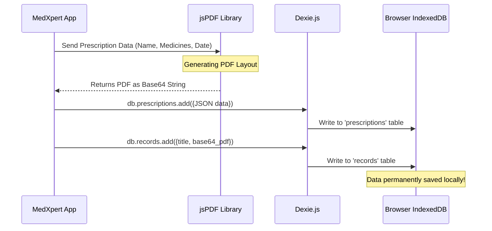

# MedXpert Workflow Architecture

Here is the complete step-by-step workflow of how data moves through the MedXpert system, showing exactly how the libraries (Dexie, Fuse, Tesseract, jsPDF) interact.

## 1. Complete System Flow

This flowchart shows the end-to-end journey from a Patient entering the clinic to the Medical Store dispensing the medicine.

## 2. Medicine Input Flow (Deep Dive)

This chart zooms in on the most complex part of the app: how a doctor's input turns into a verified medicine name using Tesseract and Fuse.js.

## 3. Data Storage Flow (Deep Dive)

This chart shows how Dexie.js handles the data storage when the prescription is finally saved.

